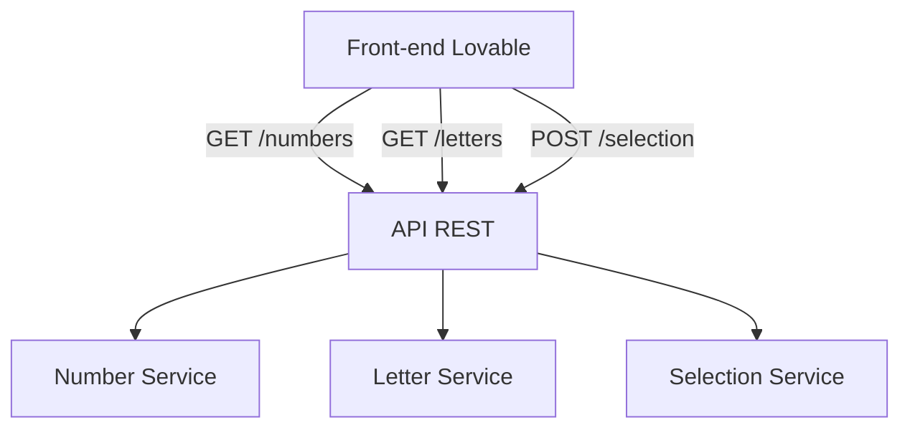

# Design Document: Dropdown Backend API

## Overview

API REST back-end que fornece listas de números e letras para uma aplicação front-end de seleção, e recebe as escolhas do usuário. A API será simples, stateless e seguirá padrões RESTful.

## Architecture



A arquitetura segue um padrão simples de API REST com três endpoints principais. Não há persistência de dados - as listas são geradas em memória e as seleções são apenas validadas e confirmadas.

## Components and Interfaces

### API Endpoints

#### GET /api/numbers
Retorna a lista de números disponíveis.

**Response (200 OK):**
```json
{
  "numbers": [1, 2, 3, 4, 5, 6, 7, 8, 9, 10]
}
```

#### GET /api/letters
Retorna a lista de letras disponíveis.

**Response (200 OK):**
```json
{
  "letters": ["A", "B", "C", "D", "E", "F", "G", "H", "I", "J"]
}
```

#### POST /api/selection
Recebe a seleção do usuário.

**Request Body:**
```json
{
  "number": 5,
  "letter": "C"
}
```

**Response (200 OK):**
```json
{
  "success": true,
  "message": "Seleção recebida com sucesso",
  "selection": {
    "number": 5,
    "letter": "C"
  }
}
```

**Response (400 Bad Request):**
```json
{
  "success": false,
  "error": "Número inválido" | "Letra inválida" | "Dados incompletos"
}
```

### Services

#### NumberService
- `getNumbers()`: Retorna array de números inteiros [1-10]

#### LetterService  
- `getLetters()`: Retorna array de letras ["A"-"J"]

#### SelectionService
- `validateSelection(number, letter)`: Valida se número e letra são válidos
- `processSelection(number, letter)`: Processa e retorna confirmação

## Data Models

### NumberList
```
{
  numbers: number[]  // Array de inteiros
}
```

### LetterList
```
{
  letters: string[]  // Array de strings (letras maiúsculas)
}
```

### SelectionRequest
```
{
  number: number     // Número selecionado
  letter: string     // Letra selecionada
}
```

### SelectionResponse
```
{
  success: boolean
  message?: string
  error?: string
  selection?: {
    number: number
    letter: string
  }
}
```


## Correctness Properties

*A property is a characteristic or behavior that should hold true across all valid executions of a system—essentially, a formal statement about what the system should do. Properties serve as the bridge between human-readable specifications and machine-verifiable correctness guarantees.*

### Property 1: Numbers endpoint returns valid integer array
*For any* GET request to /api/numbers, the response SHALL contain a JSON object with a "numbers" field containing an array where all elements are integers.
**Validates: Requirements 1.1, 1.3**

### Property 2: Letters endpoint returns valid letter array
*For any* GET request to /api/letters, the response SHALL contain a JSON object with a "letters" field containing an array where all elements are single uppercase letters (A-Z).
**Validates: Requirements 2.1, 2.3**

### Property 3: Valid selections are accepted
*For any* number from the valid numbers list and *any* letter from the valid letters list, a POST to /api/selection with that combination SHALL return success with status 200.
**Validates: Requirements 3.1**

### Property 4: Invalid inputs are rejected
*For any* number NOT in the valid numbers list OR *any* letter NOT in the valid letters list, a POST to /api/selection SHALL return status 400 with an error message.
**Validates: Requirements 3.3, 3.4**

### Property 5: CORS headers are present
*For any* response from the API, the response SHALL include appropriate CORS headers (Access-Control-Allow-Origin).
**Validates: Requirements 4.1**

## Error Handling

| Scenario | HTTP Status | Response |
|----------|-------------|----------|
| Número inválido | 400 | `{"success": false, "error": "Número inválido"}` |
| Letra inválida | 400 | `{"success": false, "error": "Letra inválida"}` |
| Corpo incompleto | 400 | `{"success": false, "error": "Dados incompletos"}` |
| Erro interno | 500 | `{"success": false, "error": "Erro interno do servidor"}` |

## Testing Strategy

### Unit Tests
- Testar NumberService.getNumbers() retorna array correto
- Testar LetterService.getLetters() retorna array correto
- Testar SelectionService.validateSelection() com entradas válidas e inválidas
- Testar casos de borda: corpo vazio, campos faltando

### Property-Based Tests
Usar biblioteca de property-based testing para validar as propriedades de corretude:
- Gerar números aleatórios e verificar validação
- Gerar letras aleatórias e verificar validação
- Verificar que combinações válidas sempre são aceitas
- Verificar que combinações inválidas sempre são rejeitadas

Configuração: mínimo 100 iterações por teste de propriedade.

### Integration Tests
- Testar fluxo completo: GET numbers → GET letters → POST selection
- Testar CORS com requisições de diferentes origens
